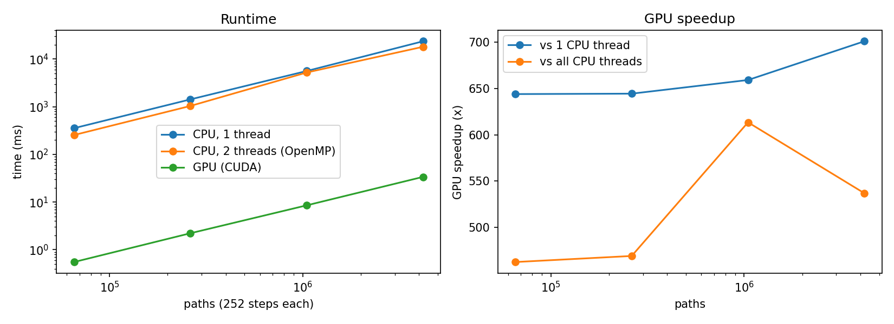

# CUDA Monte Carlo Option Pricing

Prices options by simulating stock-price paths with geometric Brownian motion, on the CPU (C++, single-threaded and OpenMP) and on the GPU (CUDA), and benchmarks the speedup.

- **European call:** checked against the Black-Scholes closed form (the result should land within ~3 standard errors).
- **Arithmetic-average Asian call:** path-dependent, with no closed form, which is why every path simulates all 252 daily steps.

## How it works

- **Same code on CPU and GPU.** `simulate_path()` is a `__host__ __device__` function, so both sides run identical math.
- **Counter-based RNG.** Each random draw is a hash of `(seed, path, step)` (splitmix64), turned into normals with Box-Muller. There's no RNG state to store or seed per thread, and path *i* is the same on CPU and GPU. GPU prices therefore match CPU prices to float rounding, which the program checks.
- **GPU kernel.** A grid-stride loop has each thread simulate many paths and keep running sums of the payoff and payoff². A shared-memory tree reduction then gives one partial result per block, and the host adds up those few hundred partials. The grid is sized from the occupancy API (`SMs × active blocks per SM × 4`).
- **Timing.** CUDA events time the kernel plus the copy back. The GPU is warmed up first, so context creation isn't counted. CPU runs are timed with `std::chrono`.
- **Accuracy.** Payoffs are summed in double precision and paths are simulated in float. The program reports the standard error and the distance from Black-Scholes in standard errors.

## Run it

**No GPU? Use Google Colab (free):** open `run_benchmark_colab.ipynb` in Colab, choose Runtime → Change runtime type → T4 GPU, then Run all. It builds the code, runs the benchmark, draws `speedup.png` and prints a results table for this README.

**With an NVIDIA GPU and the CUDA toolkit:**

```bash
make            # nvcc -O3 -arch=native -Xcompiler -fopenmp -o mc mc_option.cu
./mc            # 65K to 4M paths, 252 steps each; writes results.csv
```

**CPU only (correctness check):** `make mc_cpu && ./mc_cpu --max-paths 1048576`

Flags: `--steps N`, `--max-paths N`, `--max-single-thread N` (skip slow single-thread runs above N paths), `--seed N`, `--csv FILE`.

## Results

_Run the Colab notebook and paste the table it prints here, along with the GPU and CPU it ran on._



Parameters: S0 = 100, K = 100, r = 5%, σ = 20%, T = 1 year, 252 steps per path. Black-Scholes European call = 10.4506.
